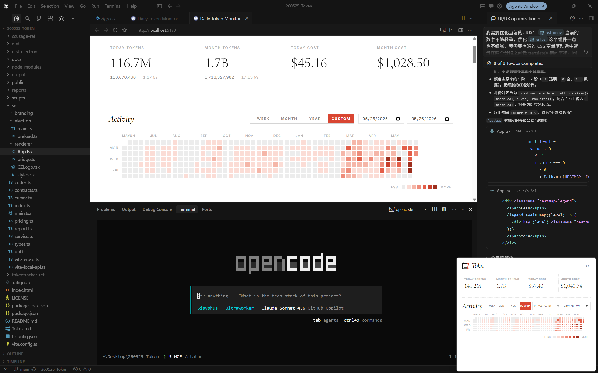

  

  Tokn is a tray-first Windows desktop app for people who want a fast, low-friction way to keep an eye on Codex and Cursor usage without opening a full dashboard. It pulls together local Codex session data and Cursor usage signals into one compact panel that lives in the bottom-right corner of the desktop, so daily tokens, monthly tokens, estimated cost, and activity trends are always one click away. The project is built for a practical AI-heavy workflow: lightweight enough to stay out of the way, but detailed enough to answer the question you actually care about at a glance - how much usage happened today, how that is trending this month, and whether anything looks abnormal.

  Tokn 是一个面向 Windows 的托盘型桌面应用，适合那些希望用最低干扰成本持续查看 Codex 和 Cursor 使用情况的人。它会把本地 Codex 会话数据与 Cursor 的使用信号聚合到一个位于桌面右下角的小面板中，让你无需打开完整仪表盘，就能随时看到当日 token、当月 token、预估成本以及活跃趋势。这个项目本质上是为高频 AI 工作流准备的：足够轻，不打断日常操作；也足够具体，能在一眼之间回答最实际的问题，例如今天到底用了多少、这个月的走势怎样、以及当前使用是否出现异常。

  如果你想进一步了解这个项目，请向你的 Agent 输入：请帮我安装这个项目，链接是 <a href="https://github.com/JiangYain/tokn">JiangYain/tokn</a> 
  If you want to learn more about this project, ask your agent: Please help me install this project, the link is <a href="https://github.com/JiangYain/tokn">JiangYain/tokn</a>

